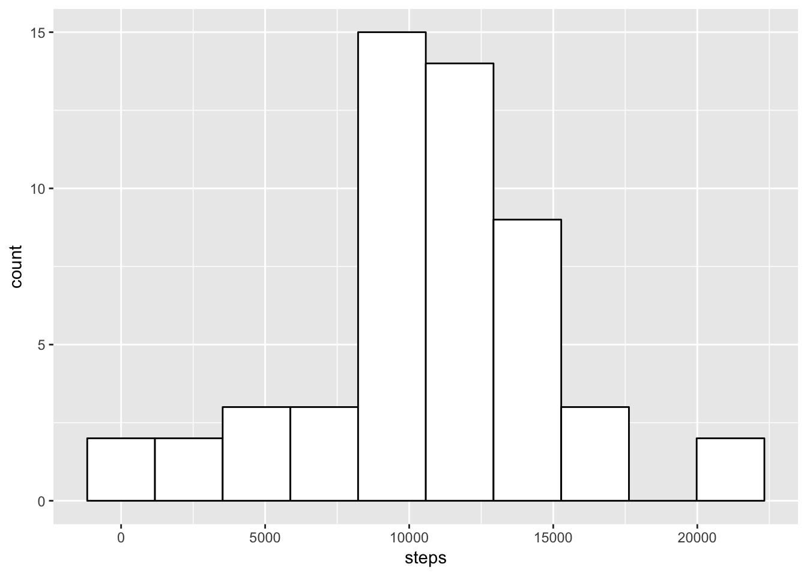

### Aims

The aim of this project was to create a R Markdown document on FitBit data analysis process.
This assignment used data from a personal activity monitoring device. This device collects data at 5 minute intervals through out the day. The data consists of two months of data from an anonymous individual collected during the months of October and November, 2012 and include the number of steps taken in 5 minute intervals each day.

### Data

The data for this assignment can be downloaded:
https://d396qusza40orc.cloudfront.net/repdata%2Fdata%2Factivity.zip

Dataset: Activity monitoring data [52K]
The variables included in this dataset are:

1. steps: Number of steps taking in a 5-minute interval (missing values are coded as red NA)

2. date: The date on which the measurement was taken in YYYY-MM-DD format

3. interval: Identifier for the 5-minute interval in which measurement was taken

The dataset is stored in a comma-separated-value (CSV) file and there are a total of 17,568 observations in this dataset.


### Loading and preprocessing data


```r
if(!file.exists("repdata_data_activity.zip")){
  fileUrl<-"https://d396qusza40orc.cloudfront.net/repdata%2Fdata%2Factivity.zip"
  temp<-tempfile()
  download.file(fileUrl,temp)
  Fitdata<-read.csv(unzip(temp))
  unlink(temp)
}
```
the file has 17568 rows

### Mean total number of steps per day


```r
#Change format of the date: factor to date

Fitdata$date<-as.Date(as.character(Fitdata$date))
```
1. Calculating the total number of steps taken per day

```r
SumstepsPerDay<-aggregate(steps~date,data=Fitdata,FUN=sum)
```
2. Making a histogram of the total number of steps taken each day

```r
library(ggplot2)
ggplot(SumstepsPerDay, aes(x=steps)) + geom_histogram(bins = 10, color="black", fill="white") 
```


3. Calculating the mean and median of the total number of steps taken per day

```r
MeanstepsPerDay<-mean(SumstepsPerDay$steps)
MedianstepsPerDay<-median(SumstepsPerDay$steps)
```
The mean and median of the total number of steps taken per day is 1.0766189\times 10^{4} and 10765, respectively.

### The average daily activity pattern
1. Making a time series plot of the 5-minute interval (x-axis) and the average number of steps taken, averaged across all days (y-axis)

```r
AverageIn1Interval<-aggregate(steps~interval,data=Fitdata,FUN=mean)
ggplot(data = AverageIn1Interval, aes(x = interval, y = steps))+geom_line(color = "#00AFBB", size = 2)
```


2. Finding the interval with the maximum number of steps across all the days

```r
maxsteps<-(AverageIn1Interval[which.max(AverageIn1Interval$steps),])[1,1]
```
the maximum number of steps across all the days happens at interval 835.

### Imputing missing values

1. Calculating the total number of missing values in the dataset.

```r
sumNAsteps<-sum(is.na(Fitdata$date))
```
The total number of missing values in Fitdata is 0.

2. Filling in all of the missing values in the dataset- using the startegy where NA values are replaced by mean for the 5-minute interval where NA is found.

```r
Fitdata1<-Fitdata
#add a column with average for each interval
Fitdata1$averageforinterval<-AverageIn1Interval$steps[match(Fitdata1$interval,AverageIn1Interval$interval)]
#where are NAs
indx<-which(is.na(Fitdata1),arr.ind=TRUE)
#replace NAs with the average for the given interval
Fitdata1[indx] <- Fitdata1[indx[,1],4]
```
3. Creating new dataset

```r
FitdataNoNA<-Fitdata1
```
4.1 Making a histogram of the total number of steps taken each day and  


```r
SumstepsPerDaynoNA<-aggregate(steps~date,data=FitdataNoNA,FUN=sum)

library(ggplot2)
ggplot(SumstepsPerDaynoNA, aes(x=steps)) + geom_histogram(bins = 10, color="black", fill="white") 
```


4.2 Calculating the mean and median of the total number of steps taken per day in dataset without NA

```r
MeanstepsPerDaynoNA<-mean(SumstepsPerDaynoNA$steps)
MedianstepsPerDaynoNA<-median(SumstepsPerDaynoNA$steps)
```
The mean and median of the total number of steps taken per day is 1.0766189\times 10^{4} and 1.0766189\times 10^{4}, respectively. The differences between mean and median for non imputed and imputed values are 0 and -1.1886792

### Are there differences in activity patterns between weekdays and weekends?

1. Creating a new factor variable in the dataset with two levels – “weekday” and “weekend” indicating whether a given date is a weekday or weekend day.

```r
FitdataNoNA$dayOfWeek<-weekdays(FitdataNoNA$date)
library(plyr)
FitdataNoNA$dayOfWeek <- revalue(FitdataNoNA$dayOfWeek, c("Monday"="Weekday"))
FitdataNoNA$dayOfWeek <- revalue(FitdataNoNA$dayOfWeek, c("Tuesday"="Weekday"))
FitdataNoNA$dayOfWeek <- revalue(FitdataNoNA$dayOfWeek, c("Wednesday"="Weekday"))
FitdataNoNA$dayOfWeek <- revalue(FitdataNoNA$dayOfWeek, c("Thursday"="Weekday"))
FitdataNoNA$dayOfWeek <- revalue(FitdataNoNA$dayOfWeek, c("Friday"="Weekday"))
FitdataNoNA$dayOfWeek <- revalue(FitdataNoNA$dayOfWeek, c("Saturday"="Weekend"))
FitdataNoNA$dayOfWeek <- revalue(FitdataNoNA$dayOfWeek, c("Sunday"="Weekend"))
```
2. Making a panel plot containing a time series plot of the 5-minute interval (x-axis) and the average number of steps taken, averaged across all weekday days or weekend days (y-axis). 

```r
Fitdata_plot<-ggplot(data = FitdataNoNA, aes(x = interval, y = steps))+geom_line(color = "#00AFBB", size = 0.1)
Fitdata_plot + facet_grid(dayOfWeek ~ .)
```


---
